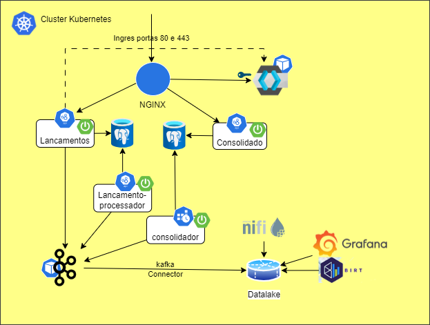

# Desafio Supermercado
## Descritivo da Solução
Um comerciante precisa controlar o seu fluxo de caixa diário com os lançamentos (débitos e
créditos), também precisa de um relatório que disponibilize o saldo diário consolidado.
## Requisitos de negócio
- Serviço que faça o controle de lançamentos
- Serviço do consolidado diário
## Requisitos técnicos obrigatórios
- Desenho da solução
- Pode ser feito na linguagem que você domina
- Testes
- Boas praticas são bem vindas (Design Patterns, Padrões de Arquitetura, SOLID e etc)
- Readme com instruções claras de como a aplicação funciona, e como rodar localmente
- Hospedar em repositório publico (GitHub)
Caso os requisitos técnicos obrigatórios não sejam minimamente atendidos, o teste será
descartado.
## Requisitos não funcionais
O serviço de controle de lançamento não deve ficar indisponível se o sistema de consolidado diário
cair.
Em dias de picos, o serviço de consolidado diário recebe 500 requisições por segundos, com no
máximo 5% de perda de requisições.
# Desenho da solução
Esta é a solução simplificada para facilitar a instalação e validação local.
A solução descrita nesta versão utiliza a solução com KAFKA cuja introdução está na próxima seção.

Para esta solução, como a inclusão de lançamentos é simples e a carga é pequena, suportanto alguns erros, as APIs incluem diretamente na base de dados. Em outros cenários poderíamos fazer o processamento de forma assíncrona inserindo comando de inclusão de lançamentos em uma fila/tópico.

A consolidação diária dos lançamentos é executado por um processo batch agendado como um Cronjob do kubernetes. Em um cenário de maior criticidade poderia ser utilizado um sistema de agendamento com monitoramento e nitificação mais robusto como o UC4 por exemplo. Esse processo batch foi construído como um microserviço. Neste cenário simplificado, poderia ser utilizado o agendador da própria base de dados ou uma ferramenta ETL, por exemplo.
Toda a aplicação foi criada na plataforma Kubernetes. Porém, é possível executar diretamente numa única máquia virtual ou laptop.


## Desenho alternativo
Neste documento vamos descrever e instalar esta versão da solução.

Inicialmente pensei em construir esta arquitetura alternativa 1, mas a implementação seria mais demorada e os testes mais complexos pois exigiria a instalação e configuração de um serviço de mensageria, um identity server e outros.

Neste caso, supondo que o processo de inclusão de lançamentos fosse custoso (demorado), seria interessante que este processamento fosse realizado de forma assíncrona.

Nesta arquitetura, precisamos refatorar o Repositório de lançamentos dividindo entre consulta e alteração.
Após a refatoração, a API Lancamentos irá realizar as consultas usando o Repositório que acessa diretamente a base de dados e as transações serão enviadas para um tópico assíncrono **Lancamento**.

Um microsserviço (Lancamento-processador) consome o tópico Consolidado e salva o resultado na base de dados de Lancamento.

Um Kafka Sink Connector consome o tópico **Lancamento** e salva o resultado no LakeHouse (datalake + datawarehouse).

Os dados no LakeHouse poderão ser usados para análise e gestão.

Vantagens desta arquitetura:
- Mais resiliente - os tópicos permitem que o sistema atenda melhor a picos de requisições e a indisponibilidades temporárias.
- É muito mais fácil escalar um cluster Kafka do que um cluster de base de dados.
- Fornecemos uma interface bem definida para exportação dos dados


### Racional
Esta solução pretende fornecer um **Produto de Negócio**, aplicando ao mesmo tempo **API as a Product** e **Data Product**. Assim temos uma funcionalidade que desenhamos com a intenção **Interface First**.

Toda a funcionalidade é definado em 2 etapas:
- Definição do domínio
- Definição das interfaces (API e Eventos)

## Base de dados
A base de dados utilizada é o PostgreSQL. A aplicação é composta por 2 microserviços (lançamentos e consolidado) cada um com seu esquema SQL composto de uma única tabela. Para facilitar a execução da demonstração, os 2 esquemas estão na mesma base de dados e no mesmo esquema do PostgreSQL.
> Caso queira executar em 2 esquemas separados do PostgreSQL, base criar o novo esquema no PGAdmin, criar a tabela e as credenciais de acesso e configurar as variáveis de ambiente POSTGRES_DB, POSTGRES_USER e POSTGRES_PASSWORD do microserviço.

O microserviço Consolidado utiliza o seguinte esquema com uma tabela.
```SQL
    create table consolidado (
        totalDebitos numeric(17,2) not null,
        totalCreditos numeric(17,2) not null,
        saldo numeric(17,2) not null,
        quantidadeDebitos integer not null,
        quantidadeCreditos integer not null,
        data date not null,
        primary key (data)
    );
```
O microserviço Lançamentos utiliza o seguinte esquema com uma tabela.
```SQL
    create table lancamento (
        valor numeric(17,2) not null,
        data timestamp(6) not null,
        id bigserial not null,
        tipo varchar(10) not null,
        descricao varchar(100) not null,
        primary key (id)
    );
```
## Microserviço "desafio-lancamentos-app"
Este microserviço faz o controle de lançamentos. Possui 1 endpoint:
- `POST /lancamentos`. Esse endpoint insere um novo lançamento. Os lançamentos são imutáveis e não podem ser alterados ou excluídos.
    Entrada:
    ```JSON
    {
        "data": "2023-11-16T00:00:00.000",
        "descricao": "Faturamento caixa 123",
        "valor": 1050,
        "tipo": "crédito"
    }
    ```
    Saída:
    ```JSON
    {
        "id": 4,
        "data": "2023-11-16T00:00:00.000",
        "descricao": "Faturamento caixa 123",
        "valor": 1050,
        "tipo": "crédito"
    }
    ```
### Arquitetura de software
Para diminuir a dependência da infraestrutura (base de dados relacional) foi utilizado o modelo Onion, injetando a implementação da dependência fazendo com que a lógica de negócio dependa apenas da interface.

Também foi utilizada a vantagem do Spring Data para criar a implementação do JPA automaticamente.
Nesta versão, injetamos a dependência LancamentoCommandKafkaRepository para gerar um evento no Kafka e não salvar diretamente na base de dados.

## Microserviço "desafio-lancamento-processador-app"
Este microserviço faz o controle de lançamentos. Ele recebe os eventos de **Lancamento** e persiste na base de dados.
Os lançamentos são imutáveis e não podem ser alterados ou excluídos.
    Entrada (evento Lancamento no Kafka):
    ```JSON
    {
        "data": "2023-11-16T00:00:00.000",
        "descricao": "Faturamento caixa 123",
        "valor": 1050,
        "tipo": "crédito"
    }
    ```
### Arquitetura de software
Para diminuir a dependência da infraestrutura (base de dados relacional) foi utilizado o modelo Onion, injetando a implementação da dependência fazendo com que a lógica de negócio dependa apenas da interface.

Também foi utilizada a vantagem do Spring Data para criar a implementação do JPA automaticamente.


## Microserviço "desafio-consolidado-app"
Este microserviço fornece o relatório de saldo diário consolidado. Possui 1 endpoint:
- `GET /consolidados/byDateRange`. Esse endpoint retorna o saldo diário consolidado.
Entrada:
    ```
    ?startDate=2023-11-12&endDate=2023-12-14
    ```
    Saída:
    ```JSON
    [
        {
            "data": "2023-11-12",
            "saldo": 99.00,
            "totalDebitos": 306.00,
            "totalCreditos": 405.00,
            "quantidadeDebitos": 3,
            "quantidadeCreditos": 2
        },
        {
            "data": "2023-11-13",
            "saldo": 399.00,
            "totalDebitos": 315.00,
            "totalCreditos": 615.00,
            "quantidadeDebitos": 3,
            "quantidadeCreditos": 3
        },
        {
            "data": "2023-11-14",
            "saldo": 699.00,
            "totalDebitos": 324.00,
            "totalCreditos": 624.00,
            "quantidadeDebitos": 3,
            "quantidadeCreditos": 3
        }
    ]
    ```
### Arquitetura de software
Para diminuir a dependência da infraestrutura (base de dados relacional) foi utilizado o modelo Onion, injetando a implementação da dependência fazendo com que a lógica de negócio dependa apenas da interface.

Também foi utilizada a vantagem do Spring Data para criar a implementação do JPA automaticamente.

## Batch "desafio-consolidador-app"
Este batch foi desenvolvido como um microserviço e executa a consolidação diária. Existem duas formas de execução:
- Sem parâmetro. O agendamento diário executa desta forma. Neste modo de execução o batch recupera o último valor consolidado e calcula o dia seguinte e depois o seguinte até chegar no dia anterior à execução.

    Exemplo, se a última consolidação é do dia 12/10 e o batch é executado no dia 30/10, então será feita a consolidação dos dias 13/10 até 29/10. Neste modo se a última consolidação foi no dia anterior, nada é executado.
- Com 1 parâmetro. O batch pode ser executado manualmente e neste caso, pode-se passar uma data como parâmetro. Neste modo, o batch vai recuperar a última consolidação anterior à data passada no parâmetro e vai consolidar todos os dias desde essa data até o dia anterior à execução.

    Exemplo: parâmetro = 12/10, última consolidação antes de 12/10 foi em 08/10 e o dia da execução é 30/10. O batch vai recuperar os valores consolidados em 08/10, calcular a consolidação dos dias 12/10 até 29/10. Neste caso, mesmo que existam valores consolidados entre os dias 12/10 a 29/10, o batch irá sobrepor os valores.

### Arquitetura de software
Para diminuir a dependência da infraestrutura (base de dados relacional) foi utilizado o modelo Onion, injetando a implementação da dependência fazendo com que a lógica de negócio dependa apenas da interface.

Também foi utilizada a vantagem do Spring Data para criar a implementação do JPA automaticamente.

# Construção
A aplicação foi desenvolvida para executar no Kubernetes, porém, é possível executar num computador físico ou VM.

## Estrutura do projeto
Este repositório contém 5 projetos
- common - model e repository
- consolidado - microsserviço api do relatório consolidado
- lancamentos - microsserviço api de lançamentos 
- lancamento-processador - microsserviço listener que persiste os lançamentos 
- consolidador - microsserviço que contém o batch consolidador

Além disso, este repositório contém arquivos de configuração dos serviços de base de dados e configuração do minikube.

A pasta /assets contém as imagens utilizadas nesta documentação.
## Pré-requistos gerais
- OpenJDK 21
- Maven 3.9.5 (ou versão acima)
- WSL2

# Instalação do Confluent Platform em modo Local no WSL2
Baseado em https://docs.confluent.io/platform/current/installation/installing_cp/zip-tar.html
- Abra um terminal WSL2 Ubunto
- update do Ubuntu

    ```
    sudo apt-get update && sudo apt-get upgrade -y
    ```
- ncessário java versão 11
    ```
    java -version
    sudo apt install openjdk-11-jre-headless
    export JAVA_HOME=/usr/lib/jvm/java-11-openjdk-amd64
    ```
- download e untar confluent community. Para este guia, estou supondo que a pasta atual é a home do usuário (/home/`username` ou seja `~/`)
    ```
    curl -O https://packages.confluent.io/archive/7.5/confluent-7.5.2.tar.gz
    tar xzf confluent-7.5.2.tar.gz
    ```
- configurar CONFLUENT_HOME e PATH
    ```
    export CONFLUENT_HOME=~/confluent-7.5.2
    export PATH=$PATH:$CONFLUENT_HOME/bin
    ```
- testar path
    ```
    confluent --help
    ```
- instalar JDBC connector
    ```
    confluent-hub install confluentinc/kafka-connect-jdbc:latest
    ```
- obtenha o IP do WSL2 com o comando `ifconfig`. Para este guia troque todas as referências a 172.9.9.9 pelo IP do WSL2.
- configurar para que aplicações externas ao WSL2 acessem o Kafka é necessário mudar as seguintes variáveis no arquivo `~/confluent-7.5.2/etc/kafka/server.properties`:
    ```
    listeners=PLAINTEXT://:9092
    advertised.listeners=PLAINTEXT://172.9.9.9:9092
    listener.security.protocol.map=PLAINTEXT:PLAINTEXT,SSL:SSL,SASL_PLAINTEXT:SASL_PLAINTEXT,SASL_SSL:SASL_SSL
    ```
- executar o Confluent Platform - pode ser que de erros de timeout (mensagem de erro simples como "Error: Kafka failed to start"), execute novamente
    ```
    confluent local services start
    ```
    - Após iniciar o Confluent Platform, verifique abrindo a URL
    ```
    http://localhost:9021/
    ```
# Instalação com Minikube
Caso seja escolhida a opção com kubernetes, é necessário um cluster instalado.

É possivel usar o Minikube que é uma versão light do kubernetes.

## Instalação do Docker e Minikube
Caso ainda não tenha o minikube, sugiro instalar com WSL2/ubuntu. Cuidado, existem tutoriais que explicam como instalar o Minikube DENTRO do WSL2, isso pode dificultar o uso do minikube. A minha sugestão é usar o WSL2 como ambiente de execução dos PODs (microsserviços). Para isso, instale o Docker Desktop e configure para usar o WSL2 (https://github.com/codeedu/wsl2-docker-quickstart). Após testar o Docker Desktop, execute o comando `docker context use default`

A instalação do minikube é simples, basta fazer o download do Minikube.exe e colocar no %PATH%.
 
O download pode ser feito seguindo as instruções em https://minikube.sigs.k8s.io/docs/start/.

Para configurar e executar, use o comando:
```
minikube start --ports=127.0.0.1:30005:30005 --ports=127.0.0.1:30006:30006 --ports=127.0.0.1:30007:30007 --ports=127.0.0.1:5432:30432 --ports=127.0.0.1:80:80 --ports=127.0.0.1:443:443
```
Esse comando irá iniciar o cluster minikube com 1 nó e irá também configurar as portas TCP necessárias para este projeto.

Após a execução do Minikube, configure o serviço Ingres com Nginx usando o comando
`minikube addons enable ingress`. Caso queira começar tudo de novo use o comando  `minikube delete` para remover o Minikube, você pode voltar e executar novamente `minibuke start --ports.....`.

Feito isso o Minikube está instalado, configurado e executando. Abra um novo terminal (cmd) para executa o dashboard `minikube dashboard`, esse comando irá iniciar o serviço e irá abrir o navegado na página de monitoramento do Minikube.

## Instalação do PostgreSql
No terminal, vá para a pasta do projeto. Nessa pasta existem alguns arquivo, entre eles `postgresconf.yaml`, `postgrespv` e `postgres.yaml`.
No arquivo `postgresconf.yaml`, altere 172.9.9.9 pelo IP do WSL2 obtido anteriormente.
Depois execute os comandos:
```
kubectl apply -f postgresconf.yaml
kubectl apply -f postgrespv.yaml
kubectl apply -f postgres.yaml
```
Esses comandos irão:
- criar a configuração da base de dados e usuário dessa base
- criar o storage físico para conter os dados
- criar a base de dados num POD e
    - expor o serviço "postgres" na porta 5432 do POD, porta 5432 do serviço interno do cluster e porta 30432 do serviço externo do cluster. O comando de inicialização do Minikube visto anteriormente permite que essa porta externa 30432 que é interna do WSL2, seja vista no Windows na porta 5432.

Dessa forma, é possível usar uma ferramenta como o PGADMIN para conectar e configurar a base de dados.

Usando o PGADMIN ou outra ferramenta que permita executar instruções SQL no postgres, conecte na base de dados. Os dados para conexão são: host:localhost, port:5432, user:postgresadmin, password:admin123

Agora, no schema "desafio", execute as instruções SQL que estão no arquivo `create.sql`. Essas instruções irão criar as tabelas.

## Configuração da resolução de domínios
Inclua no arquivo c:\windows\drivers\etc\hosts, as seguintes configurações.
Não esqueça de trocar 172.9.9.9 pelo endeço IP do WSL2 que foi obtido durante a instalaçao do Kafka. Se não anotou, é possível obter o endereço abrindo um terminal do ubuntu usar o comando `ifconfig`
```
#ingress & keycloak
127.0.0.1 ingress-nginx-controller-admission.ingress-nginx.svc
127.0.0.1 keycloak.127.0.0.1.nip.io

#desafio supermercado
127.0.0.1 lancamentos.desafio.info consolidado.desafio.info

#kafka
172.9.9.9 wsl2
```

## Instalação do componente **desafio-common**
No terminal, vá para a pasta do projeto e vá para a sub-pasta `common` (esta é a pasta do projeto do componente common). Então compile, empacote e instale no repositório local do Maven:
```
mvn clean install
```
Este componente contém o Model e os repositórios JPA.

## Instalação do microsserviço Lancamento
No terminal, vá para a pasta do projeto e vá para a sub-pasta `lancamentos` (esta é a pasta do projeto do microserviço lançamentos). Então compile o microsserviço, empacote e crie a imagem docker:
```
mvn clean install
docker build --file=Dockerfile --tag=desafio-lancamentos-app:latest --rm=true .
```
Agora carrege a imagem no minikube.
```
minikube image load desafio-lancamentos-app:latest
```
Hora de iniciar o microsserviço:
```
kubectl apply -f deployment-lancamento.yaml
```
Esse comando irá iniciar 2 PODs contendo o microserviço Lançamento e também criará o service que expões esse microserviço "desafio-lancamentos-app" na porta 8080 do POD, porta 80 do serviço interno do cluster e porta 30005 do serviço externo do cluster. O comando de inicialização do Minikube visto anteriormente permite que essa porta externa 30005 que é interna do WSL2, seja vista no Windows na porta 30005.

Os PODs podem ser vistos no Dashboard. Ou através do comando `kubectl get pods`. O resultado do comando será algo semelhante a:
```
NAME                                       READY   STATUS    RESTARTS   AGE
desafio-lancamentos-app-bfb978bc9-9rncg    1/1     Running   0          11h
desafio-lancamentos-app-bfb978bc9-qfb9f    1/1     Running   0          11h
keycloak-6b8864dcdc-sm742                  1/1     Running   0          11h
postgres-67d5897d8f-2ct7m                  1/1     Running   0          12h
```
Para ver o log do microsserviço utilize o comando `kubectl logs desafio-lancamentos-app-bfb978bc9-9rncg`, substituindo o nome do POD.
Você pode acessar a especificação swagger na URL `http://localhost:30005/swagger-ui/index.html`
Ou, usando o Ingress NGINX: `http://lancamentos.desafio.info/swagger-ui/index.html`

## Instalação do microsserviço Lancamento-processador
No terminal, vá para a pasta do projeto e vá para a sub-pasta `lancamento-processador` (esta é a pasta do projeto do microserviço lancamento-processador). Então compile o microsserviço, empacote e crie a imagem docker:
```
mvn clean install
docker build --file=Dockerfile --tag=desafio-lancamento-processador-app:latest --rm=true .
```
Agora carrege a imagem no minikube.
```
minikube image load desafio-lancamento-processador-app:latest
```
Hora de iniciar o microsserviço:
```
kubectl apply -f deployment-lancamento-processador.yaml
```
Esse comando irá iniciar 2 PODs contendo o microserviço lancamento-processador.

Os PODs podem ser vistos no Dashboard. Ou através do comando `kubectl get pods`. O resultado do comando será algo semelhante a:
```
NAME                                                  READY   STATUS    RESTARTS      AGE
desafio-lancamento-processador-app-7bf765cb47-26bgr   1/1     Running   0             10s
desafio-lancamento-processador-app-7bf765cb47-66grm   1/1     Running   0             10s
desafio-lancamentos-app-bfb978bc9-726b2               1/1     Running   0             9m41s
desafio-lancamentos-app-bfb978bc9-nfl56               1/1     Running   0             9m41s
keycloak-6b8864dcdc-ftz77                             1/1     Running   5 (45m ago)   2d21h
postgres-67d5897d8f-v5bk9                             1/1     Running   4 (45m ago)   2d21h
```
Para ver o log do microsserviço utilize o comando `kubectl logs desafio-lancamento-processador-app-7bf765cb47-26bgr`, substituindo o nome do POD.

## Instalação do microsserviço Consolidado
No terminal, vá para a pasta do projeto e vá para a sub-pasta `consolidado` (esta é a pasta do projeto do microserviço consolidado). Então compile o microsserviço, empacote e crie a imagem docker:
```
mvn clean install
docker build --file=Dockerfile --tag=desafio-consolidado-app:latest --rm=true .
```
Agora carrege a imagem no minikube.
```
minikube image load desafio-consolidado-app:latest
```
Hora de iniciar o microsserviço:
```
kubectl apply -f deployment-consolidado.yaml
```
Esse comando irá iniciar 2 PODs contendo o microserviço consolidado e também criará o service que expões esse microserviço "desafio-consolidado-app" na porta 8080 do POD, porta 81 do serviço interno do cluster e porta 30006 do serviço externo do cluster. O comando de inicialização do Minikube visto anteriormente permite que essa porta externa 30006 que é interna do WSL2, seja vista no Windows na porta 30006.

Os PODs podem ser vistos no Dashboard. Ou através do comando `kubectl get pods`. O resultado do comando será algo semelhante a:
```
NAME                                       READY   STATUS    RESTARTS   AGE
desafio-consolidado-app-5bb47dcfd5-ktn65   1/1     Running   0          6h39m
desafio-consolidado-app-5bb47dcfd5-pdzcv   1/1     Running   0          6h39m
desafio-lancamentos-app-bfb978bc9-9rncg    1/1     Running   0          11h
desafio-lancamentos-app-bfb978bc9-qfb9f    1/1     Running   0          11h
keycloak-6b8864dcdc-sm742                  1/1     Running   0          11h
postgres-67d5897d8f-2ct7m                  1/1     Running   0          12h
```
Para ver o log do microsserviço utilize o comando `kubectl logs desafio-consolidado-app-5bb47dcfd5-ktn65`, substituindo o nome do POD.
Você pode acessar a especificação swagger na URL `http://localhost:30006/swagger-ui/index.html`
Ou, usando o Ingress NGINX: `http://consolidado.desafio.info/swagger-ui/index.html`

## Instalação do microsserviço batch Consolidador
No terminal, vá para a pasta do projeto e vá para a sub-pasta `consolidador` (esta é a pasta do projeto do microserviço consolidador). Então compile o microsserviço, empacote e crie a imagem docker:
```
mvn clean install
docker build --file=Dockerfile --tag=desafio-consolidador-app:latest --rm=true .
```
Agora carrege a imagem no minikube (isso vai demorar poucos minutos).
```
minikube image load desafio-consolidador-app:latest
```
O arquivo **deployment-consolidador.yaml** contém a configuração do serviço. Nesse arquivo a configuração `schedule: "5 0 * * *"` fará o batch ser executado todos os dias à meia-noite e 5 minutos. Você pode alterar essa configuração para uma execução mais frequente para que possa testar mais facilmente. Por exemplo, `schedule: "*/3 * * * *"` executará  cada 3 minutos.

Hora de iniciar o **agendamento** microsserviço, execute:
```
kubectl apply -f deployment-consolidador.yaml
```
Esse comando irá agendar o batch.

Uma vez agendado, utilize o comando abaixo para verificar os agendamentos e execuções:
```
kubectl get cronjob desafio-consolidador-app
```
O resultado é similar a
```
NAME                       SCHEDULE    SUSPEND   ACTIVE   LAST SCHEDULE   AGE
desafio-consolidador-app   */3 * * * * False     0        <none>          6s
```
A lista acima indica que está agendado mas nunca executou. Essa mesma lista pode ser visto no Dashboard.

Passado o tempo de agendamento o resultado deve mudar para algo similiar a:
```
NAME                       SCHEDULE      SUSPEND   ACTIVE   LAST SCHEDULE   AGE
desafio-consolidador-app   */3 * * * *   False     2        91s             6m28s
```
Uma vez que já temos execuções do Job Batch, podemos usar o comando `kubectl get jobs --watch` para verificar as execuções (isso também pode ser visto no Dashboard). O resultado será:
```
NAME                                COMPLETIONS   DURATION   AGE
desafio-consolidador-app-28339284   0/1           4m38s      4m38s
desafio-consolidador-app-28339287   0/1           98s        98s
```
O comando continuará monitorando indefinidamente. Tecle Control+C para terminar o comando.

Agora vamos ver quais PODs foram executados numa execução do Job usando o comando:
```
kubectl get pods --selector=job-name=desafio-consolidador-app-28339287
```
Não esqueça de trocar o nome do job.

No nosso caso esse comando sempre retornará apenas 1 POD, pois nosso batch é composto apenas por 1 imagem.
```
NAME                                      READY   STATUS    RESTARTS   AGE
desafio-consolidador-app-28339287-7njlv   1/1     Running   0          108s
```
Agora podemos ver o log de execução com o comando `kubectl logs desafio-consolidador-app-28339287-7njlv`

Este é um exemplo de finalização do Job com sucesso:
```
2023-11-19T01:57:29.888Z DEBUG 1 --- [           main] org.hibernate.SQL                        : insert into Consolidado (quantidadeCreditos,quantidadeDebitos,saldo,totalCreditos,totalDebitos,data) values (?,?,?,?,?,?)
Hibernate: insert into Consolidado (quantidadeCreditos,quantidadeDebitos,saldo,totalCreditos,totalDebitos,data) values (?,?,?,?,?,?)
2023-11-19T01:57:29.891Z TRACE 1 --- [           main] org.hibernate.orm.jdbc.bind              : binding parameter [1] as [BIGINT] - [0]
2023-11-19T01:57:29.893Z TRACE 1 --- [           main] org.hibernate.orm.jdbc.bind              : binding parameter [2] as [BIGINT] - [0]
2023-11-19T01:57:29.896Z TRACE 1 --- [           main] org.hibernate.orm.jdbc.bind              : binding parameter [3] as [NUMERIC] - [904.00]
2023-11-19T01:57:29.898Z TRACE 1 --- [           main] org.hibernate.orm.jdbc.bind              : binding parameter [4] as [NUMERIC] - [0]
2023-11-19T01:57:29.898Z TRACE 1 --- [           main] org.hibernate.orm.jdbc.bind              : binding parameter [5] as [NUMERIC] - [0]
2023-11-19T01:57:29.898Z TRACE 1 --- [           main] org.hibernate.orm.jdbc.bind              : binding parameter [6] as [DATE] - [2023-11-18]
2023-11-19T01:57:29.915Z  INFO 1 --- [           main] c.desafio.service.ConsolidadorService    : Consolidado atualizado para 2023-11-18. Crédito: 0; Débito: 0; Saldo: 904.00
2023-11-19T01:57:29.916Z  INFO 1 --- [           main] com.desafio.ConsolidadorApplication      : APPLICATION FINISHED
2023-11-19T01:57:29.926Z  INFO 1 --- [ionShutdownHook] j.LocalContainerEntityManagerFactoryBean : Closing JPA EntityManagerFactory for persistence unit 'default'
2023-11-19T01:57:29.928Z  INFO 1 --- [ionShutdownHook] com.zaxxer.hikari.HikariDataSource       : HikariPool-1 - Shutdown initiated...
2023-11-19T01:57:29.952Z  INFO 1 --- [ionShutdownHook] com.zaxxer.hikari.HikariDataSource       : HikariPool-1 - Shutdown completed.
```
Você pode consultar a tabela ***Consolidados*** para verificar o resultado.
```
SELECT * FROM public.consolidado ORDER BY data ASC
```
Se já existirem lançamentos deve retornar algum resultado, caso contrário você verá um único registro com data de ontem e saldo 0.

Há duas formas de recalcular um dia:
- excluindo todos os consolidados do dia e de dias posteriores
- executando o consolidador com o parâmetro da data (veja a estratégia de execução no Windows).

# Instalação no ambiente Windows
## Instalação do PostgreSql
Deve-se instalar o [PostgreSQL](https://www.postgresql.org/download/windows/) e [PgAdmin](https://www.pgadmin.org/).
É necessário criar o esquema **desafio** e o usuário **postgresadmin** com senha **admin123**, esse usuário deve possuir permissão de acesso ao esquema **desafio**. É possível usar outros valores mas será necessário adaptar os passos seguintes de acordo. A porta TCP deve ser configurada para 5432.

Usando o PGADMIN ou outra ferramenta que permita executar instruções SQL no postgres, conecte na base de dados.

Agora, no schema "desafio", execute as instruções SQL que estão no arquivo `create.sql`. Essas instruções irão criar as tabelas.

## Configuração da resolução de domínios
Inclua no arquivo c:\windows\drivers\etc\hosts, as seguintes configurações.
#desafio supermercado
```
127.0.0.1 lancamentos.desafio.info consolidado.desafio.info
```
## Instalação do componente **desafio-common**
No terminal, vá para a pasta do projeto e vá para a sub-pasta `common` (esta é a pasta do projeto do componente common). Então compile, empacote e instale no repositório local do Maven:
```
mvn clean install
```
Este componente contém o Model e os repositórios JPA.

## Instalação do microsserviço Lancamento
No terminal, vá para a pasta do projeto e vá para a sub-pasta `lancamentos` (esta é a pasta do projeto do microserviço lançamentos). Então compile o microsserviçoe empacote:
```
mvn clean install
```
Hora de iniciar o microsserviço:
```
java -jar target\desafio-lancamentos-0.0.1-SNAPSHOT.jar
```
Esse comando irá iniciar o microserviço "desafio-lancamentos-app" na porta 8080.

Você pode acessar a especificação swagger na URL `http://localhost:8080/swagger-ui/index.html`

## Instalação do microsserviço Lancamento-processador
No terminal, vá para a pasta do projeto e vá para a sub-pasta `lancamentos-processador` (esta é a pasta do projeto do microserviço lançamento-processador). Então compile o microsserviçoe empacote:
```
mvn clean install
```
Hora de iniciar o microsserviço:
```
java -jar target\desafio-lancamentos-processador-0.0.1-SNAPSHOT.jar
```
Esse comando irá iniciar o microserviço "desafio-lancamento-processador-app" que passará a receber eventos do tópico **Lancamento**.

## Instalação do microsserviço Consolidado
No terminal, vá para a pasta do projeto e vá para a sub-pasta `consolidado` (esta é a pasta do projeto do microserviço consolidado). Então compile o microsserviçoe empacote:
```
mvn clean install
```
Hora de iniciar o microsserviço:
```
java -jar target\desafio-consolidado-0.0.1-SNAPSHOT.jar
```
Esse comando irá iniciar o microserviço "desafio-consolidado-app" na porta 8082.

Você pode acessar a especificação swagger na URL `http://localhost:8082/swagger-ui/index.html`


## Instalação do microsserviço batch Consolidador
No terminal, vá para a pasta do projeto e vá para a sub-pasta `consolidador` (esta é a pasta do projeto do microserviço consolidador). Então compile o microsserviço e empacote:
```
mvn clean install
```

Hora de iniciar o **agendamento** microsserviço. No Windows você pode usar o **Task scheduler** (**Agendador de tarefas** na versão em português).
Configure para executar 1 vez por dia (ou para testar configure para executar a cada 5 minutos por exemplo).
Ao configurar peça para executar o arquivo consolidador.bat que está na pasta consolidador do projeto. Configure para iniciar a aplicação na pasta onde o consolidador.bat se encontra.

O comando continuará monitorando indefinidamente. Tecle Control+C para terminar o comando.

Você pode consultar a tabela ***Consolidados*** para verificar o resultado.
```
SELECT * FROM public.consolidado ORDER BY data ASC
```

Se já existirem lançamentos deve retornar algum resultado, caso contrário você verá um único registro com data de ontem e saldo 0.

Há duas formas de recalcular um dia:

- excluindo todos os consolidados do dia e de dias posteriores
- executando o consolidador com o parâmetro da data. Num terminal entre na pasta do projeto consolidador e execute o comando **java -jar target\desafio-consolidador-0.0.1-SNAPSHOT.jar 2023-11-12**.

    Isso fará com que sejam (re)calculados todos os dias entre 2023-11-12 até a data do dia anterior à execução (ontem).


# Testando
Após a instalação e execução podemos testar usando:
- Postman
- pgadmin
- inikube dashboard

No Postman, importe a collection 
[DesafioSupermercado](DesafioSupermercado.postman_collection.json).


